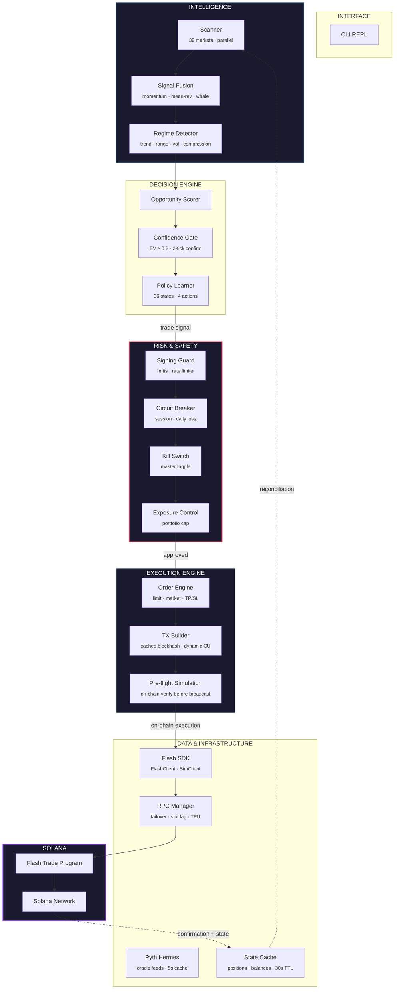

<p align="center">
  
</p>

<h1 align="center">Flash Terminal</h1>

<p align="center">
  <strong>Deterministic, on-chain trading infrastructure for Solana perpetual futures.</strong>
</p>

<p align="center">
  Not a wrapper. Not a dashboard. A full execution engine —<br/>
  with real-time risk systems and every parameter derived from chain state.
</p>

<p align="center">
  <a href="https://solana.com"></a>&nbsp;
  <a href="https://www.typescriptlang.org"></a>&nbsp;
  <a href="https://www.flash.trade"></a>&nbsp;
  <a href="https://github.com/Abdr007/flash-terminal/actions"></a>&nbsp;
  &nbsp;
  <a href="https://github.com/Abdr007/flash-terminal/blob/main/LICENSE"></a>
</p>

<p align="center">
  <a href="https://flash-terminal-docs.vercel.app">Docs</a>&nbsp;&nbsp;·&nbsp;&nbsp;<a href="https://flash-terminal-docs.vercel.app/guide/quick-start">Quick Start</a>&nbsp;&nbsp;·&nbsp;&nbsp;<a href="https://flash-terminal-docs.vercel.app/reference/trading-commands">Commands</a>&nbsp;&nbsp;·&nbsp;&nbsp;<a href="https://github.com/Abdr007/flash-terminal/releases">Releases</a>&nbsp;&nbsp;·&nbsp;&nbsp;<a href="CONTRIBUTING.md">Contributing</a>
</p>

---

## Install

```bash
npm install -g flash-terminal
flash
```

Requires Node.js 20+. See [Quick Start](https://flash-terminal-docs.vercel.app/guide/quick-start) for full setup.

---

## Why This Exists

Most trading tools are UI-first, opaque, and unsafe by default. They hide execution details, fabricate convenience data, and give you no control over what happens between your intent and the chain.

Flash Terminal takes the opposite approach:

- **Transparent** — every fee, margin, and liquidation price is derived from on-chain `CustodyAccount` state.
- **Deterministic** — no prediction engines, no black-box AI, no hidden logic between your command and the transaction.
- **Controlled** — circuit breakers, signing gates, kill switches, and rate limits are not optional add-ons. They're core infrastructure.
- **Engineer-first** — built for people who read diffs, not dashboards.

---

## What Makes This Different

| | Flash Terminal | Typical Trading UI |
|:--|:--|:--|
| **Execution** | Direct on-chain via Flash SDK | API abstraction layers |
| **Prices** | Pyth Hermes oracle (same feed as protocol) | Exchange APIs, delayed feeds |
| **Parameters** | Read from chain every request | Cached, approximated, or hardcoded |
| **Risk controls** | 10-layer safety stack, always on | Optional, usually client-side |
| **Automation** | Deterministic execution with safety gates | Bots with static rules |
| **Data integrity** | Zero fabricated values — verified or absent | Estimated, interpolated |
| **Transparency** | Full audit trail, every signing logged | Limited or no logging |

---

## Core Capabilities

```
32 markets  ·  7 pools  ·  up to 500x leverage  ·  sub-second TX broadcast
Crypto  ·  Commodities  ·  Forex  ·  Equities  ·  Meme  ·  Governance
```

| Capability | Description |
|:-----------|:------------|
| **Live Trading** | Open, close, and manage leveraged perp positions on Solana mainnet |
| **Simulation Mode** | Paper trading with real oracle prices. No transactions, no risk. |
| **Risk Engine** | Circuit breakers, runtime state machine, health monitoring, and backpressure |
| **Limit Orders** | On-chain limit order placement, editing, and cancellation |
| **TP/SL Automation** | Take-profit and stop-loss with 2-tick spike protection |
| **Liquidity (Earn)** | Deposit, stake, and manage FLP/sFLP across all Flash pools |
| **FAF Staking** | Governance staking, VIP tiers, revenue sharing, referrals |
| **Protocol Inspection** | Inspect pools, markets, fees, OI, and on-chain parameters directly |
| **Risk Monitor** | Background liquidation monitoring with tiered alerts |
| **Token Swaps** | Swap tokens via Flash Trade routing |

---

## Architecture Overview

Seven isolated layers, strict downward communication. The risk layer sits between every decision and every transaction — no bypass path exists. Market data flows up through caches, execution flows down through safety gates, and state reconciliation keeps the CLI in sync with on-chain reality.



---

## Performance & Execution Model

Trading systems fail when they're slow. Flash Terminal is engineered for low-latency execution with bounded resource usage.

**Transaction Pipeline:**

| Stage | Latency | Method |
|:------|:--------|:-------|
| Blockhash acquisition | ~0ms (pre-cached) | Background refresh every 2s, 5s max age |
| Transaction build + sign | <50ms | MessageV0 compile, Ed25519 signing |
| Broadcast | <100ms | Parallel send to all healthy RPC endpoints |
| Confirmation | <45s | WebSocket subscription + HTTP polling fallback |
| Rebroadcast | Every 800ms | Adaptive interval until confirmed or timeout |

**Caching Strategy:**

| Data | TTL | Purpose |
|:-----|:----|:--------|
| Oracle prices | 5s | Reduce RPC load, consistent pricing |
| Market snapshots | 15s | Feed technical analysis, reduce fetches |
| Decision signals | 10s | LRU cache for signal fusion |
| Regime classification | 30s | Per-market condition state |
| Priority fees | 5s | Network congestion tracking |
| Wallet balances | 30s | Invalidated post-trade |

**Bounded Memory:**

Every data structure has a hard cap. Price caches max at 50 entries. Trade journals cap at 2,000. Performance metrics use pre-allocated circular buffers (Float64Array, 1,000 samples). No unbounded growth. No GC pressure on long sessions.

**RPC Resilience:**

Multi-endpoint failover with health monitoring every 30s. Automatic switching on: connection failure, latency >5s, slot lag >50. Circuit breaker on Pyth oracle with exponential cooldown (30s to 120s) when feeds are unreachable.

---

## Safety & Risk Systems

This is the most important section. Trading systems without safety systems aren't trading systems — they're liabilities.

Flash Terminal has **10 independent safety layers**. They're always active. They can't be bypassed by any command input.

| Layer | What It Does | Trigger |
|:------|:-------------|:--------|
| **Signing Guard** | Full trade summary before every signature. Enforces per-trade collateral, position size, and leverage limits. | Every trade |
| **Rate Limiter** | 10 trades/min max, 3s minimum delay between trades. Configurable. | Automatic |
| **Circuit Breaker** | Halts all trading when session or daily loss exceeds threshold. Requires manual reset. | Cumulative loss |
| **Kill Switch** | Master toggle. Disables all 4 trade operations instantly. Monitoring continues. | `TRADING_ENABLED=false` |
| **Execution Kill-Switch** | Auto-halts on slippage >50bps (5 trades), 3 consecutive fill failures, or p90 latency >10s. 5-min cooldown. | Execution degradation |
| **Transaction Simulation** | On-chain simulation catches program errors before any funds are at risk. | Every TX |
| **Program Whitelist** | Only Flash Trade + Solana system programs allowed in instructions. | Every TX |
| **Instruction Freeze** | `Object.freeze()` on instruction array post-validation. No mutation before signing. | Every TX |
| **Duplicate Detection** | Signature cache (120s TTL) prevents resubmission of landed transactions. | Every TX |
| **State Reconciliation** | Periodic blockchain sync. On-chain state is always authoritative. | Every 60s + post-trade |

**Circuit Breaker Configuration:**

```bash
MAX_SESSION_LOSS_USD=500        # Halt after $500 session loss
MAX_DAILY_LOSS_USD=1000         # Halt after $1000 daily loss
MAX_PORTFOLIO_EXPOSURE=10000    # Max total exposure
```

When any threshold is hit, trading stops. No exceptions. No overrides. Reset requires a new session.

---

## Data Integrity

Every number in Flash Terminal has a verified source. This is non-negotiable.

| Data | Source | Validation |
|:-----|:-------|:-----------|
| **Prices** | Pyth Hermes | Staleness <30s, confidence <2%, deviation <50%. Same feeds used by Flash on-chain. |
| **Positions** | Flash SDK | On-chain `PositionAccount` via `perpClient.getUserPositions()`. |
| **Fees** | On-chain `CustodyAccount` | Open/close fee rates, leverage limits, maintenance margins. |
| **Liquidation** | Flash SDK helper | `getLiquidationPriceContractHelper()` with divergence check (0.5% threshold). |
| **Open Interest** | fstats API | Response body capped at 2MB. Parameters sanitized with `encodeURIComponent`. |
| **Wallet Balances** | Solana RPC | `getBalance()` for SOL, `getParsedTokenAccountsByOwner()` for SPL tokens. |

**If a source is unreachable, the value is absent — not estimated.** Stale cache is returned with clear staleness indicators. No data is ever fabricated.

---

## Quick Start

### Install

```bash
npm install -g flash-terminal
```

Or from source:

```bash
git clone https://github.com/Abdr007/flash-terminal.git
cd flash-terminal && npm install && npm run build
```

### Configure

```bash
cp .env.example .env
```

| Variable | Required | Description |
|:---------|:---------|:------------|
| `RPC_URL` | Yes | Solana mainnet RPC endpoint |
| `WALLET_PATH` | Yes | Path to Solana CLI keypair file |
| `SIMULATION_MODE` | No | `true` (default) for paper trading |
| `ANTHROPIC_API_KEY` | No | Enables natural language commands |

**Requirements:** Node.js >= 20 · Solana RPC (mainnet-beta)

### Run

```bash
flash
```

Starts in simulation mode by default. Live trading requires `SIMULATION_MODE=false` and a funded wallet (SOL for fees, USDC for collateral).

---

## CLI Experience

```
$ flash

  FLASH TERMINAL
  ────────────────────────────────

  Select Mode
    1) LIVE TRADING
    2) SIMULATION

  > 1

  Wallet connected: ABDR
  Address:  Dvvzg9...GLfmK
  SOL:      1.96 SOL
  USDC:     142.34 USDC

flash [live] > open 2x long SOL $100

  CONFIRM TRANSACTION
  ─────────────────────────────────
  Market:      SOL LONG
  Leverage:    2x
  Collateral:  $100.00
  Size:        $200.00
  Fees:        Open: $0.20 | Est. close: $0.20
  Liq Distance: 48.2%

  Type "yes" to sign (yes/no) > yes

  Position Opened
  Entry: $148.52 | Size: $200.00 | Liq: $77.31
  TX: https://solscan.io/tx/5rdUxK...

flash [live] > positions

  Market  Side  Lev  Size     Collateral  Entry    Mark     PnL
  SOL     LONG  2x   $200.00  $100.00     $148.52  $149.01  +$0.66

flash [live] > set tp SOL long $160
flash [live] > set sl SOL long $140

  TP/SL active — evaluating every 5s with 2-tick confirmation.

flash [live] > risk monitor on

  Risk monitor started. (prices 5s, positions 20s)

flash [live] > dashboard

  PORTFOLIO
  ─────────────────────────
  Positions:   1
  Exposure:    $200.00
  Total PnL:   +$0.66
  Risk Level:  SAFE (48.2% from liquidation)

flash [live] > close SOL long

  Position closed — PnL: +$1.24
```

---

## Features Deep Dive

### Trading

```
open 5x long SOL $500           # Open position
close BTC short                  # Close position
add $200 to SOL long             # Add collateral
remove $100 from ETH long        # Remove collateral
dryrun open 10x long ETH $250   # Preview without executing
close all                        # Close all positions
limit long SOL 2x $100 @ $82    # Limit order
orders                           # View on-chain orders
swap SOL USDC $10                # Token swap
```

### Earn (Liquidity)

```
earn                             # View pools with live yield
earn deposit $100 crypto         # USDC → FLP (auto-compound)
earn stake $200 governance       # FLP → sFLP (USDC rewards)
earn claim                       # Claim rewards
earn best                        # Rank pools by yield + risk
earn simulate $1000 crypto       # Project yield returns
earn dashboard                   # LP portfolio overview
```

### FAF Token

```
faf                              # Staking dashboard
faf stake 1000                   # Stake FAF (VIP + revenue share)
faf unstake 500                  # 90-day linear unlock
faf claim                        # Claim FAF + USDC rewards
faf tier                         # VIP levels + benefits
```

### Market Intelligence

```
analyze SOL                      # Deep market analysis
monitor                          # Live market table (5s refresh)
open interest                    # OI breakdown by market
whale activity                   # Large position tracking
funding SOL                      # OI imbalance + fee data
depth SOL                        # Liquidity depth analysis
inspect protocol                 # Protocol-level overview
inspect pool Crypto.1            # Pool inspection
source verify SOL                # Data provenance verification
```

### Risk & Portfolio

```
portfolio                        # Portfolio overview
risk report                      # Position risk assessment
exposure                         # Exposure breakdown
risk monitor on                  # Background monitoring
tp status                        # Active TP/SL targets
```

### System

```
doctor                           # Full diagnostics
system health                    # Event loop, memory, errors
rpc status                       # Active endpoint info
rpc test                         # Test all endpoints
tx inspect <sig>                 # Transaction inspection
system audit                     # Protocol data integrity
```

---

## Security Model

### Key Management

- Loaded from Solana CLI keypair files with **path validation**, **symlink resolution**, and **1KB size limit**.
- Never logged. Never transmitted over network. Never stored in memory longer than the session.
- Zeroed from memory on disconnect or 15-minute idle timeout.
- **Integrity verified before every signing operation.** Corrupted keys are rejected.

### Transaction Security

- **Program whitelist** — only Flash Trade and Solana system programs permitted.
- **Instruction freeze** — `Object.freeze()` post-validation prevents tampering.
- **On-chain simulation** — every transaction is simulated before broadcast.
- **Signing audit log** — every attempt recorded to `~/.flash/signing-audit.log` with timestamp, market, result. Never logs keys.

### Network Security

- **RPC URLs validated** on startup. HTTPS enforced (HTTP only for localhost).
- **Private IP ranges and embedded credentials rejected.**
- **API response size limits** — 2MB for fstats, 1MB for CoinGecko. Prevents OOM from malicious endpoints.
- **Log scrubbing** — API keys masked (`sk-ant-***`, `gsk_***`) in all output. Files created with `0o600` permissions.
- **Query parameter sanitization** — `encodeURIComponent()` on all API parameters.

### Operational Security

- **Log rotation** — 10MB max with `.old` / `.old.2` backups. No disk exhaustion.
- **Session timeout** — wallet auto-disconnects after 15 minutes idle.
- **Crash recovery** — trade journal records pending TXs. Recovery engine verifies on-chain status on restart.

---

## Testing & Reliability

```bash
npm test        # 1,926 tests, ~5s
npm run lint    # zero warnings
npm run build   # strict TypeScript, zero errors
```

**Coverage areas:** Trading execution, simulation fidelity, signing guard, circuit breaker, kill switch, TP/SL automation, market resolution, protocol fee validation, event monitoring, earn/liquidity, FAF staking, swap validation, retry budget, chaos resilience, command parsing, wallet session management, and infrastructure hardening.

**CI pipeline:** Every push runs build + lint + full test suite. Releases require passing tests with minimum 800 assertions. Dependabot runs monthly. Devnet integration tests run weekly.

---

## Production Status

Flash Terminal is in **stable maintenance** on Solana mainnet.

| Metric | Value |
|:-------|:------|
| Version | v1.1.1 |
| Markets | 32 active across 7 pools |
| Test suite | 1,926 assertions passing |
| TypeScript | Strict mode, zero errors |
| Security audit score | 87/100 |
| Uptime target | Continuous (with graceful degradation) |

**Release policy:** Patch releases for bug fixes and security. Minor releases for non-breaking improvements. Major releases reserved for architectural changes (none planned).

---

## Configuration Reference

All configuration via environment variables. See `.env.example` for the complete reference.

<details>
<summary><strong>Trade Limits & Rate Limiting</strong></summary>

```bash
MAX_COLLATERAL_PER_TRADE=0       # Max USD per trade (0 = unlimited)
MAX_POSITION_SIZE=0               # Max position size (0 = unlimited)
MAX_LEVERAGE=0                    # Max leverage (0 = market default)
MAX_TRADES_PER_MINUTE=10          # Rate limit
MIN_DELAY_BETWEEN_TRADES_MS=3000  # Minimum delay
```

</details>

<details>
<summary><strong>Risk Controls</strong></summary>

```bash
MAX_SESSION_LOSS_USD=500          # Session loss halt
MAX_DAILY_LOSS_USD=1000           # Daily loss halt
MAX_PORTFOLIO_EXPOSURE=10000      # Max total exposure
```

</details>

<details>
<summary><strong>RPC & Network</strong></summary>

```bash
BACKUP_RPC_1=https://...          # Failover endpoint 1
BACKUP_RPC_2=https://...          # Failover endpoint 2
FLASH_DYNAMIC_CU=true             # Dynamic compute estimation
FLASH_CU_BUFFER_PCT=20            # CU buffer percentage
COMPUTE_UNIT_PRICE=500000         # Priority fee (microLamports)
```

</details>

<details>
<summary><strong>Alerts & Webhooks</strong></summary>

```bash
ALERT_WEBHOOK_URL=https://...     # Generic webhook
SLACK_WEBHOOK_URL=https://...     # Slack integration
ALERT_MIN_SEVERITY=warning        # info, warning, critical
```

Payloads fire on: trade execution, risk limit triggered, RPC failure, circuit breaker activation. Fire-and-forget with 5s timeout — never blocks the trade path.

</details>

<details>
<summary><strong>Session & Logging</strong></summary>

```bash
SESSION_TIMEOUT_MS=900000         # 15-min idle timeout
LOG_FILE=~/.flash/flash.log       # Auto-rotates at 10MB
FLASH_LOG_LEVEL=info              # debug, info, warn, error
FLASH_LOG_FORMAT=text             # text or json
```

</details>

<details>
<summary><strong>Advanced</strong></summary>

```bash
FLASH_STRICT_PROTOCOL=false       # Throw on liq price divergence
SHADOW_TRADING=false              # Mirror trades to risk engine
NO_DNA=1                          # Programmatic mode (structured JSON output)
```

</details>

---

## Project Architecture

Layered, modular system where each layer has strict boundaries. No layer reaches past its neighbor. Safety infrastructure is enforced at the boundary between intent and execution.

```
src/
│
│  ── Interface ──────────────────────────────────────────────
│
├── cli/               Interactive REPL, command dispatch, tab completion, market monitor
├── ai/                NLP intent parser with deterministic regex primary path
│
│  ── Intelligence ───────────────────────────────────
│
│                        exit intelligence, production validator, system governor
├── scanner/           Parallel market scanner — 32 markets, opportunity scoring
├── strategies/        Signal generators: momentum, mean reversion, whale follow
├── regime/            Market condition classifier: trend, range, volatility, compression
│
│  ── Execution Engine ───────────────────────────────────────
│
├── core/              ★ TX engine — pre-cached blockhash, multi-endpoint broadcast,
│                        state reconciliation, execution middleware
├── transaction/       Instruction builder: ALT resolver, ATA resolver, aggregator
├── orders/            Limit order engine with on-chain placement and cancellation
│
│  ── Risk & Safety ──────────────────────────────────────────
│
├── security/          ★ Signing guard, circuit breaker, kill switch, rate limiter
├── risk/              TP/SL engine (2-tick confirmation), exposure analysis, liquidation math
├── monitor/           Background risk monitor (5s prices, 20s positions), event monitor
├── shadow/            Risk mirror — parallel shadow execution for strategy validation
│
│  ── Data & Network ─────────────────────────────────────────
│
├── client/            FlashClient (live on-chain) + SimulatedFlashClient (paper trading)
├── data/              PriceService (Pyth Hermes), FStatsClient (protocol analytics)
├── network/           RPC manager — multi-endpoint failover, TPU routing, slot lag detection
├── config/            Config loader, SDK-driven pool mapping, market discovery, env validation
├── protocol/          Protocol inspector — on-chain pool, market, OI, and fee inspection
│
│  ── Portfolio & Finance ────────────────────────────────────
│
├── portfolio/         Portfolio manager, rebalance analysis, allocation, risk metrics
├── earn/              Liquidity pool registry, FLP/sFLP management, yield analytics
├── token/             FAF governance token: staking, VIP tiers, revenue sharing, referrals
│
│  ── Observability & Recovery ───────────────────────────────
│
├── observability/     Metrics export, alert hooks, webhook/Slack consumers
├── system/            Health monitor (memory, event loop, RPC), diagnostics, maintenance
├── journal/           Trade journal with crash recovery — pending TX verification on restart
│
│  ── Foundation ─────────────────────────────────────────────
│
├── wallet/            Wallet manager, session lifecycle, encrypted store, token balances
├── tools/             Tool engine — 60+ command implementations, help system
├── plugins/           Dynamic plugin loader with runtime tool registration
├── types/             Central type definitions, enums, Zod validation schemas
└── utils/             Logger (scrubbed), formatting, retry (circuit breaker), market resolver
```

`★` — Critical system modules. Changes require full test suite verification.

---

## Docker

```bash
docker build -t flash-terminal .
docker run -it --env-file .env flash-terminal
```

Multi-stage build with non-root user. Defaults to simulation mode.

---

## Contributing

Contributions welcome. See **[CONTRIBUTING.md](CONTRIBUTING.md)** for development setup, code style, and PR guidelines.

---

## Disclaimer

Flash Terminal executes real blockchain transactions on Solana mainnet in live mode. Leveraged perpetual futures trading carries significant risk of total loss. Past performance does not guarantee future results.

Users are solely responsible for understanding the risks of leveraged trading, configuring appropriate risk limits, and verifying protocol state before executing high-value trades.

This software is provided as-is. It is not financial advice. It is not investment advice. Use at your own risk.

---

## License

MIT — see **[LICENSE](LICENSE)** for details.

---

<p align="center">
  <strong>Flash Terminal</strong><br/>
  Deterministic on-chain trading infrastructure for Solana perpetuals.<br/>
  Built with strict TypeScript. 1,926 tests. Zero fabricated data.
</p>
